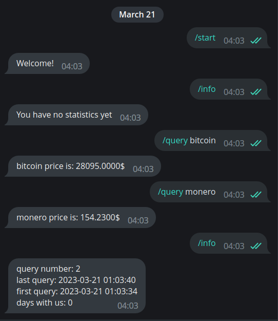

# crypto-price-bot

## How to run

Set up environment variables. Templates available in `./env/`

### Using docker

```bash
docker-compose up -d
```

### Using go run

```bash
go run ./cmd/
```

## Gallery



